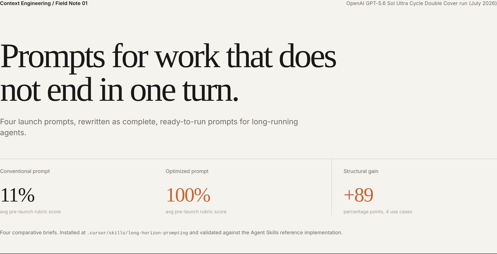

# Long-Horizon Prompt Lab

A before/after showcase for the [`long-horizon-prompting`](../../skills/long-horizon-prompting/)
skill. It takes four competent, prompt-engineered launch prompts for long-running autonomous
agents, applies the skill to each, and scores both versions against the skill's own 10-dimension
pre-launch rubric. A static UI renders the pairs side by side for screenshotting.

This example was built by applying the skill to itself: each "after" is a complete launch prompt
produced with the skill's brief-writing workflow, and the scoring uses the rubric from
[`task-brief-template.md`](../../skills/long-horizon-prompting/references/task-brief-template.md).



## What is here

```
report/            The exemplar the skill is anchored on, fetched local with provenance
  cdc_prompt.pdf     OpenAI's published GPT-5.6 Sol Ultra Cycle Double Cover prompt
  cdc_proof.pdf      The candidate proof (unreviewed; see caveats)
  cdc_prompt.txt     Text extraction (for grep/diff)
  cdc_proof.txt
  PROVENANCE.md      Source URLs, SHA-256, retrieval date, caveats
scripts/
  fetch_report.sh    Re-fetch the report PDFs and re-extract text
  verify_report.py   Assert the skill's annotated CDC reference matches the published prompt
  install_skill.sh   Install the skill into .cursor/skills and validate it
  build_lab.py       Source of truth: prompt pairs + rubric scores -> data/ and ui/data.js
  capture.mjs        Render the UI and capture the release screenshots
data/prompt-pairs.json  Machine-readable pairs and scores
ui/                Static, dependency-free UI (open index.html directly)
screenshots/       Generated PNGs for sharing
```

## The four use cases

Each "before" is a genuine prompt-engineered launch prompt (expert persona, task context,
chain-of-thought, explicit output format, persistence). None is a strawman. Each "after" is a
complete, copy-ready prompt that applies the pseudo-formal task-brief method; it is not a template
or an outline.

| Use case | Domain | Topology | Failure the brief pre-blocks |
| --- | --- | --- | --- |
| Autonomous model-improvement run | ML training | Single agent | "Beat the number" invites train-on-eval and single-seed noise wins |
| Parallel approximation-ratio proof | Algorithms / theory | 64-worker orchestration | Frequent-sync consensus is a diversity-collapse recipe |
| Long-horizon distributed-systems RCA | Concurrency | Multi-session single agent | "Find the root cause" has no checkable success predicate |
| Autonomous security audit / red-team | AppSec | Parallel workers | Persistence + checklist inflates unconfirmed findings |

The dominant edit differs by case (contamination guards for ML, diversity policy for the proof,
a reproduction predicate for RCA, non-counting outcomes for the audit), which is the point: the
skill is a checklist of independent failure modes, not one trick.

## Reproduce

```bash
# From the repo root. Requires python3 with pypdf and Pillow, and Node with Chrome available.
python3 -m pip install pypdf Pillow skills-ref

# 1. Bring the exemplar report local and verify the skill reference is faithful to it
examples/long-horizon-prompt-lab/scripts/fetch_report.sh
python3 examples/long-horizon-prompt-lab/scripts/verify_report.py

# 2. Install the skill into this project's .cursor/skills and validate it
examples/long-horizon-prompt-lab/scripts/install_skill.sh

# 3. Regenerate the pair data and the screenshots
python3 examples/long-horizon-prompt-lab/scripts/build_lab.py
cd examples/long-horizon-prompt-lab && npm install && node scripts/capture.mjs
```

The UI is static: open `ui/index.html` directly in a browser, or serve the folder. Use the tabs
to switch use cases; the URL hash (`#security-audit`) deep-links a case for consistent captures.

## How to read the scorecard

Each dimension is scored 0 (absent), 1 (present but gameable), or 2 (adversary-proof), straight
from the skill's rubric. `n/a` marks dimensions that do not apply (the diversity policy is
irrelevant to a single-agent run). The total is over applicable dimensions only.

## Honesty and limits

- The scores use the **skill's own rubric**, so a high "after" score means the brief fully
  applies the skill's checklist, measured by that checklist. This is a structural comparison of
  specification quality, not an outcome benchmark. It shows the briefs are harder to satisfy with
  a near miss; it does not claim any particular run succeeds.
- Every pair carries a **residual risk** the brief cannot remove (harness-enforced budgets,
  lenient proof verification, solvability framing on ill-posed problems, prompt-advisory scope
  limits). These are shown in the UI, not hidden.
- The CDC candidate proof in `report/` had **no peer review or formalization at publication**.
  The validated artifact of interest is the prompt structure, not the theorem. See
  `report/PROVENANCE.md`.
- `.cursor/` is gitignored in this repo, so the installed skill copy is not committed;
  `scripts/install_skill.sh` is the reproducible record of the install.

## Skills demonstrated

`long-horizon-prompting` (primary). Adjacent skills referenced by the briefs' division of labor:
`harness-engineering` (runtime-enforced budgets and permissions), `multi-agent-patterns`
(topology behind the orchestration policy), `advanced-evaluation` (adversarial audit design).
